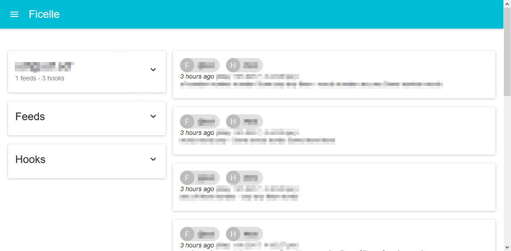

# Ficelle

A web application providing your own and customisable activity feed.

[`ficelle`](https://fr.wiktionary.org/wiki/ficelle), in french, is a little [`fil`](https://fr.wiktionary.org/wiki/fil)
which means both [`wire`](https://en.wiktionary.org/wiki/wire) and [`feed`](https://en.wiktionary.org/wiki/feed) in
english.



## Concepts

A single page application, including all activity feeds you regularly check: email, RSS, Facebook, scheduler, IoT stuff
(ringbell, coffee, alarm, ...), access log to your server, status update on a delivery...

With `ficelle`, each `user` can create their own `feeds`, powered by `hooks`.

There are two kinds of `hooks` :

 - `webhook` that can feed a `feed` through the `ficelle` API;
 - `cronhook` that are scheduled to feed the `feed` periodically.

## Features

### Features (roadmap)

 -  [x] Users self registering / login
 -  [x] Feed management
   -  [x] Feed creation
   -  [x] Feed editing (front)
   -  [x] Feed removal (front)
 -  [x] Hook management
   -  [x] Hook creation (only webhook)
   -  [x] Displaying all kind of hook (front)
   -  [x] Displaying hooks config template (front)
   -  [x] Hook editing (front)
   -  [x] Hook removal (front)
 -  [x] User logout
 -  [x] Implementing some CronHook

### Hooks

 - [x] Webhook
   - [x] API
   - [ ] Slack (?)
 - [ ] Cronhook
   - [X] RSS
   - [ ] Email (?)
   - [ ] Reddit
   - [ ] Twitter
   - [ ] jeuxvideo.com (?)
   - [ ] fnac.com (?)
   - [ ] laposte.com

## Run with docker

### Build the image

```
git clone http://.../ficelle.git/
cd ficelle/
sh build.sh
```

### Run the image

```
docker-compose up
```

## Settings

The following environment variables can be set to change `ficelle` settings:

|  Name                   | Values           | Default | Description |
|-------------------------|------------------|---------|-------------|
| `FICELLE_DEBUG`         | `True` / `False` | `False` | Enable the debug mode of `django` backend
| `FICELLE_ALLOW_REGISTER`| `True` / `False` | `True`  | Allow users to self register

## Run in a development environement

```bash
git clone http://.../ficelle.git/
cd ficelle/
cd django &&
  python manage.py runserver &
cd ../react/ &&
  npm run start
```

