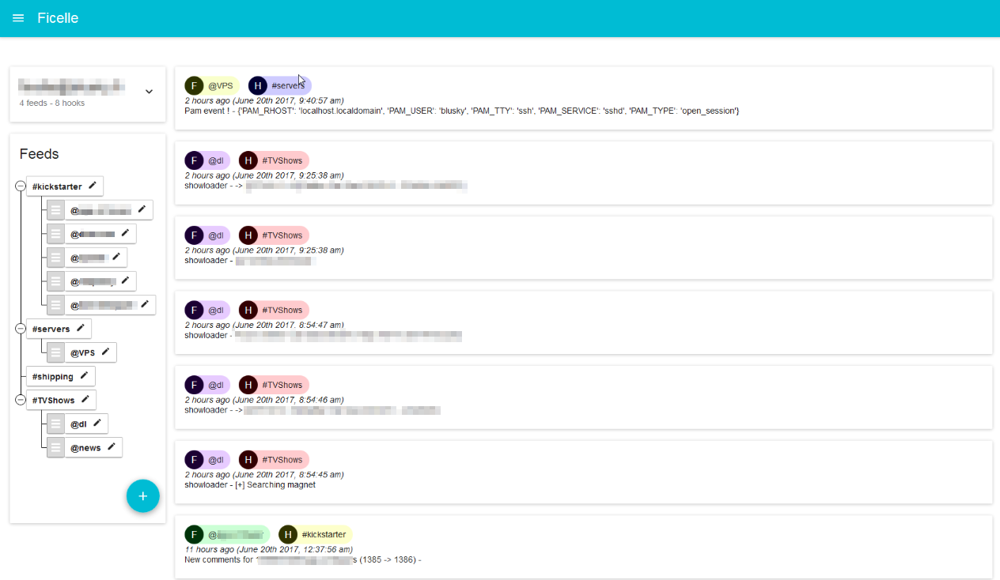

# Ficelle

A web application providing your own and customisable activity feed.

[`ficelle`](https://fr.wiktionary.org/wiki/ficelle), in french, is a little [`fil`](https://fr.wiktionary.org/wiki/fil)
which means both [`wire`](https://en.wiktionary.org/wiki/wire) and [`feed`](https://en.wiktionary.org/wiki/feed) in
english.



## Concepts

A single page application, including all activity feeds you regularly check: email, RSS, Facebook, scheduler, IoT stuff
(ringbell, coffee, alarm, ...), access log to your server, status update on a delivery...

With `ficelle`, each `user` can create their own `feeds`, powered by `hooks`.

There are two kinds of `hooks` :

 - `webhook` that can feed a `feed` through the `ficelle` API;
 - `cronhook` that are scheduled to feed the `feed` periodically.

## Features

### To-do

 - Front
  - [ ] JSON Schema for Hook editing
  - [ ] Filtering on Hook / Feed
 - Server
  - [ ] Implement more services
  - [ ] Ficelle event within ficelle event
  - [ ] More testing

### Hooks

 - [x] Webhook
   - [x] API
   - [ ] Slack (?)
 - [ ] Cronhook
   - [X] Dummy Hook that gives time
   - [X] RSS
   - [X] Torrent API
   - [ ] Email (?)
   - [ ] Reddit
   - [ ] Twitter
   - [ ] jeuxvideo.com (?)
   - [ ] fnac.com (?)
   - [ ] laposte.com

## Run with docker

### Build the image

```
git clone https://github.com/TheBlusky/ficelle.sh
cd ficelle/
sh build.sh
```

### Run the image

```
docker-compose up
```

## Settings

The following environment variables can be set to change `ficelle` settings:

|  Name                   | Values           | Default | Description |
|-------------------------|------------------|---------|-------------|
| `FICELLE_DEBUG`         | `True` / `False` | `False` | Enable the debug mode of `django` backend
| `FICELLE_ALLOW_REGISTER`| `True` / `False` | `True`  | Allow users to self register

## Under the hood


## Run in a development environement

If you want to contribute to `ficelle`, the following layers must be deployed (for en dev. environement)
```bash
git clone https://github.com/TheBlusky/ficelle.sh
cd ficelle/
cd django/

# Run django webserver (including Runner and Worker)
python manage.py runserver

# Run celery beat and worker (only for cronhooks, but require a Redis instance)
python celery_beat.py
python celery_worker.py

cd ../react/
# Run npm for having an instance of the front
npm run start
```

Then, the application should be available in your browser at `http://localhost:3000`.

## Create a new Hook

### 1. Create the hook

Just create a python file under `django/hooks/hooks/`. Eg: `django/hooks/hooks/my_super_hook.py`

### 2. Boilerplate

```
from api.models import Hook


def get_default():
    schema = {
        "type": "object",
        "properties": {
            "url": {
                "type": "string",
                "title": "URL"
            }
        }
    }
    return schema, Hook.XXX


def init(settings, frequency):
    return state, frequency

def update_cron(create_item, state, settings):
    return state, settings


def update_web(request, create_item, state, settings):
    return state, settings
```

### 3. Implement it all !!!

A `hook` used the following three concepts:

 - `settings` is a dictionary settable by the user, containing information required by the hook to works (api key, credentials, urls, ...)
 - `state` is a dictionary settable by the `hook` instance, but readable by the user, containing information needed for further execution of the hook (such as savec data)
 - `frequency` is the frequency of the hook, the following value are possible :
 
 

|  Name                   | Values           |
|-------------------------|------------------|
| `FREQUENCY_NEVER` | The hook is not launched periodicly (`webhook`) |
| `FREQUENCY_MINUTE`    | Each minute |
| `FREQUENCY_HALFHOUR`  | Each half hour |
| `FREQUENCY_HOUR`  | Each hour |
| `FREQUENCY_DAY`   | Each day |
| `FREQUENCY_WEEK`  | Each week |

Implementation of the `hook` requires 3 steps:

 - `get_default()` that return settings schema and frequency for the hook
 - `init()` that is executed when a hook is created
 - `update_cron()` / `update_web()` that is the main process of a `hook`
 
 
#### a. `get_default()` 

The `get_default()` function is called when the user lists available hooks. The function returns a t-uple, containing:

- A [JSON Schema](http://json-schema.org/) that will be used by the front-end to generate settings form. You can play
with [JSON Schema](http://json-schema.org/) using the
[react-jsonschema-form](https://mozilla-services.github.io/react-jsonschema-form/) react library.
- A default frequency

#### b. `init()`

The `init()` function is called when the `hook` is created. The function is called with the following parameters:

- `settings`, which is a dictionary, sent by the user, witht he `hook` settings.
- `frequency`, which is the frequency desired by the user.

The function shall return a t-uple containing :

- `state`, in order to initialize the state of the hook instance
- `frequency`, if you need to overide given value (Eg: `FREQUENCY_NEVER` for a `WebHook`)

#### c. `update_cron()` / `update_web()`

tbd